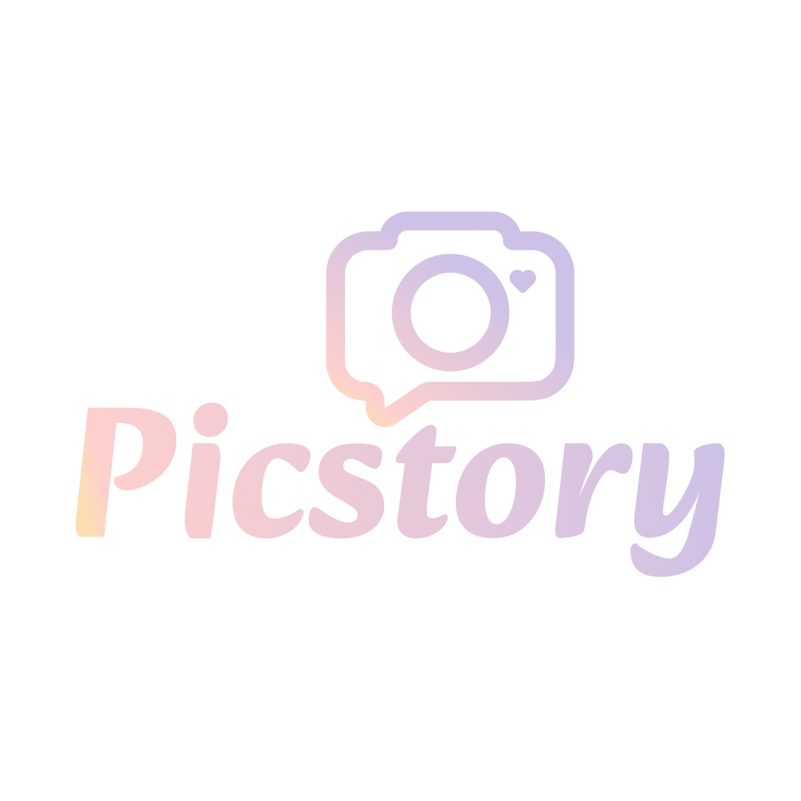

<div align="center">
  
  
  # PicStory Web
  
  **사진으로 이야기를 공유하는 소셜 플랫폼**
  
  
  
  
</div>

---

## 📖 프로젝트 소개

PicStory는 사용자들이 사진을 통해 자신만의 이야기를 공유할 수 있는 현대적인 소셜 미디어 플랫폼입니다. Vue 3와 현대적인 웹 기술을 사용하여 직관적이고 반응형 사용자 경험을 제공합니다.

### ✨ 주요 기능

- 🔐 **사용자 인증** - 회원가입 및 로그인 시스템
- 📸 **사진 피드** - 타임라인 형태의 사진 공유
- 🖼️ **갤러리 뷰** - 사진들을 갤러리 형태로 탐색
- 👤 **프로필 관리** - 개인 프로필 및 설정
- 🔍 **상세 보기** - 사진 확대 및 상세 정보 모달

## 🛠️ 기술 스택

- **Frontend Framework**: Vue 3.2.13
- **Build Tool**: Vue CLI 5.0
- **Language**: JavaScript (ES6+)
- **Styling**: CSS3
- **Package Manager**: Yarn

## 📁 프로젝트 구조

```
picstory-web/
├── public/                 # 정적 파일
│   ├── favicon.svg        # 파비콘
│   └── index.html         # HTML 템플릿
├── src/                   # 소스 코드
│   ├── components/        # Vue 컴포넌트
│   │   ├── PicstoryApp.vue    # 메인 앱 컴포넌트
│   │   ├── LoginPage.vue      # 로그인 페이지
│   │   ├── SignupPage.vue     # 회원가입 페이지
│   │   ├── FeedPage.vue       # 피드 페이지
│   │   ├── GalleryPage.vue    # 갤러리 페이지
│   │   ├── ProfilePage.vue    # 프로필 페이지
│   │   └── DetailModal.vue    # 상세 보기 모달
│   ├── assets/            # 에셋 파일
│   │   └── logo.png       # 로고 이미지
│   ├── App.vue           # 루트 컴포넌트
│   └── main.js           # 앱 진입점
├── babel.config.js       # Babel 설정
├── jsconfig.json        # JavaScript 설정
├── vue.config.js        # Vue CLI 설정
└── package.json         # 프로젝트 의존성
```

## 🚀 시작하기

### 사전 요구사항

- Node.js (v14 이상)
- Yarn 패키지 매니저

### 설치 및 실행

1. **의존성 설치**

   ```bash
   yarn install
   ```

2. **개발 서버 실행**

   ```bash
   yarn serve
   ```

   브라우저에서 `http://localhost:8080`으로 접속

3. **프로덕션 빌드**

   ```bash
   yarn build
   ```

4. **코드 린팅**
   ```bash
   yarn lint
   ```

## 📱 화면 구성

### 🔐 인증 페이지

- **로그인**: 기존 사용자 로그인
- **회원가입**: 새 계정 생성

### 📸 메인 기능

- **피드**: 사진들의 타임라인 뷰
- **갤러리**: 그리드 형태의 사진 갤러리
- **프로필**: 사용자 프로필 및 설정 관리

### 🔍 상세 기능

- **상세 모달**: 사진 확대 보기 및 추가 정보

## 🎨 UI/UX 특징

- **반응형 디자인**: 모바일과 데스크톱 모두 지원
- **모던 UI**: 깔끔하고 직관적인 사용자 인터페이스
- **부드러운 전환**: 페이지 간 매끄러운 네비게이션

## 🔧 개발 정보

### 개발 환경 설정

프로젝트는 Vue CLI를 기반으로 구성되어 있으며, 다음과 같은 설정을 포함합니다:

- **ESLint**: 코드 품질 관리
- **Babel**: 최신 JavaScript 기능 사용
- **Hot Reload**: 개발 시 실시간 변경사항 반영

### 브라우저 지원

- Chrome (최신 2버전)
- Firefox (최신 2버전)
- Safari (최신 2버전)
- Edge (최신 2버전)

## 📄 라이선스

이 프로젝트는 비공개 라이선스로 보호됩니다.

---

<div align="center">
  Made with ❤️ using Vue.js
</div>
